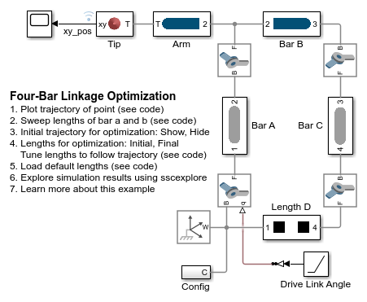

# **Four-Bar Linkage Optimization**
Copyright 2017-2023 The MathWorks(TM), Inc.

View on File Exchange:   
You can also open in MATLAB Online: 

Models a four-bar linkage in Simscape Multibody.  The lengths
of the links are parameterized using MATLAB variables.  Adjusting
those lengths enables the tip of the four-bar linkage to follow
different trajectories. Using optimization algorithms, the
lengths can be automatically tuned so that the tip follows a 
desired trajectory.

Open project Four_Bar_Optim.prj to get started.

## **Main Model**

## **Visualization**

## **Optimization**

